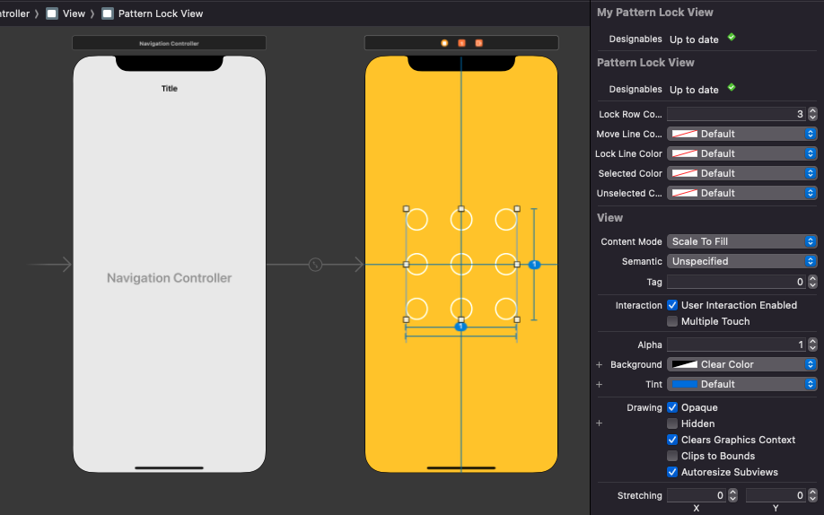

# WWPatternLockView
[](https://developer.apple.com/swift/) [](https://developer.apple.com/swift/)  [](https://developer.apple.com/swift/) [](https://developer.apple.com/swift/)

### [Introduction - 簡介](https://swiftpackageindex.com/William-Weng)
- [Mimics Android's Pattern Lock feature.](https://arstechnica.com/information-technology/2015/08/new-data-uncovers-the-surprising-predictability-of-android-lock-patterns/)
- [模仿Android的圖形解鎖功能。](https://medium.com/jeremy-xue-s-blog/swift-玩玩-手勢-圖形解鎖-gesture-password-6863654b3f8b)


### [Installation with Swift Package Manager](https://medium.com/彼得潘的-swift-ios-app-開發問題解答集/使用-spm-安裝第三方套件-xcode-11-新功能-2c4ffcf85b4b)

```bash
dependencies: [
    .package(url: "https://github.com/William-Weng/WWPatternLockView.git", .upToNextMajor(from: "1.0.0"))
]
```



### [Function - 可用函式](https://ezgif.com/video-to-webp)
|函式|功能|
|-|-|
|setting(lockRowCount:moveLineColor:lockLineColor:selectedColor:unselectedColor:)|相關數值設定|

### Example
```swift
import UIKit
import WWPrint
import WWPatternLockView

@IBDesignable
final class MyPatternLockView: WWPatternLockView {}

final class ViewController: UIViewController {
    
    @IBOutlet weak var patternLockView: MyPatternLockView!
    
    override func viewDidLoad() {
        super.viewDidLoad()
        patternLockView.delegate = self
    }
}

extension ViewController: WWPatternLockViewDelegate {
    
    func patternLockView(_ patternLockView: WWPatternLockView, didSelected password: [Int]) {
        wwPrint(password)
    }
    
    func patternLockView(_ patternLockView: WWPatternLockView, didFinished password: [Int]) {
        wwPrint(password)
    }
}

```
